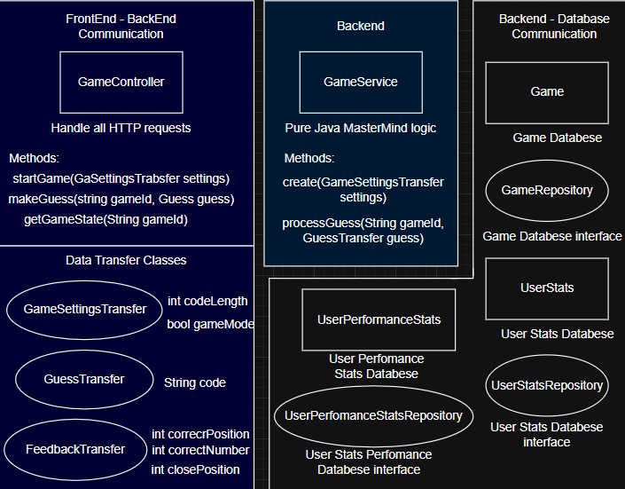

# Project 1 - MasterMind
Mastermind is a logic-based game where the computer generates a hidden sequence of digits, and the player tries to guess it.  

## Technologies
It's a full-stack mobile application with:
 - Backend → Java Spring Boot (Coursera - Spring Boot Web Development with Java)
 - Frontend → React Native
 - Database → PostgreSQL 

## Game Modes
 ### Mode 1: Numbers Can Repeat (Standard MasterMind)
 This is the classic MasterMind game, where numbers in the hidden code may repeat.
 
 After each attempt, the player receives feedback:
 - Position and number → Number that are in the correct position.
 - Number → Number presents in the hidden code, but placed in the wrong position.
 Numbers already counted as “correct position” are not counted again as “wrong position.”

 ### Mode 2: All Numbers Are Unique (Custom Family Variant)
 This is a unique version of the game that I learned from my mother.
 In this mode, all Numbers in the hidden code are unique – no Numbers repeats.
 
 Feedback in this mode:
 - Position and number → Number guessed correctly in the correct position.
 - Close → Number that are in the hidden code, but shifted one place to the left or right.
 
 Example:
 
 #### **Special Rule**
 If the player chooses a code length of 4, then the Numbers 1, 2, 3, and 4 are guaranteed to be in the hidden code exactly once each.
 **The challenge is to determine their correct order.**

## Features
 - Customizable code length (up to **8 digits**).
 - Option to enforce **unique Numbers**.
 - Multiple input/output modes:
   - **TXT** (plain text)
   - **API-styled** (framed output).

## How to Play
 1. Player chooses:
    - Length of the hidden sequence
    - Game mode
 2. Game generates a hidden sequence.
 3. Player makes guesses.
 4. After each guess, feedback is provided according to the selected mode.
 5. When the sequence is guessed correctly → The player can access game statistics.

## Error Handling
 - All input is validated.
 - If input is invalid, the player is asked to try again.
 - Empty or invalid strings are handled safely.
 - The player can exit the game at any time.

## Java Classes

## Database
 
